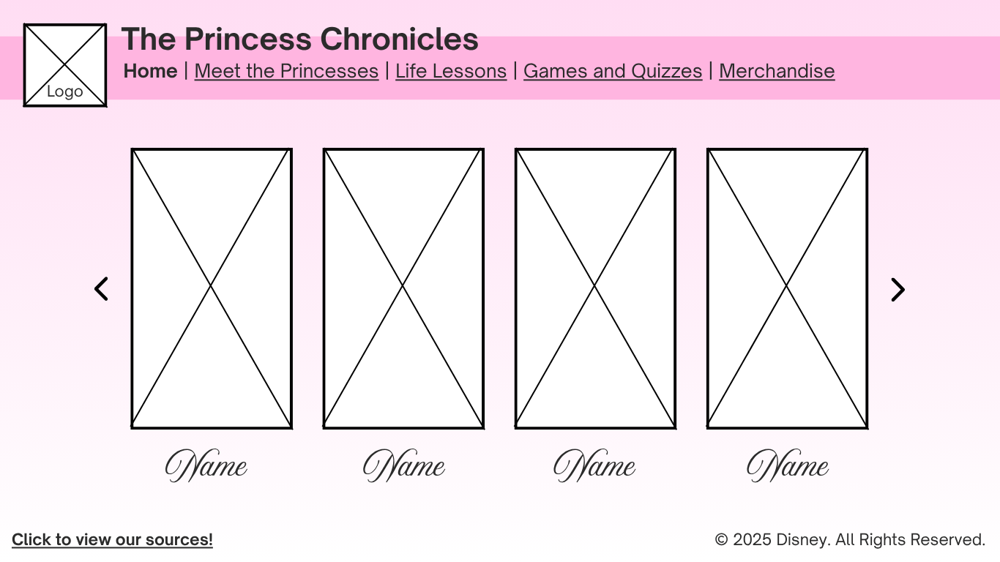
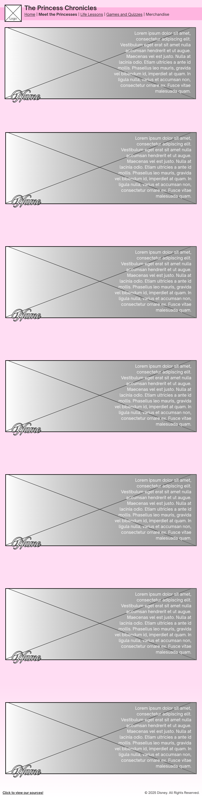
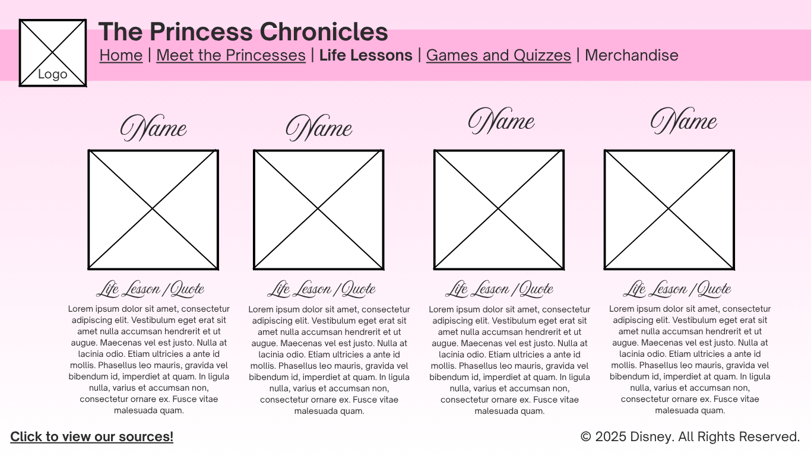
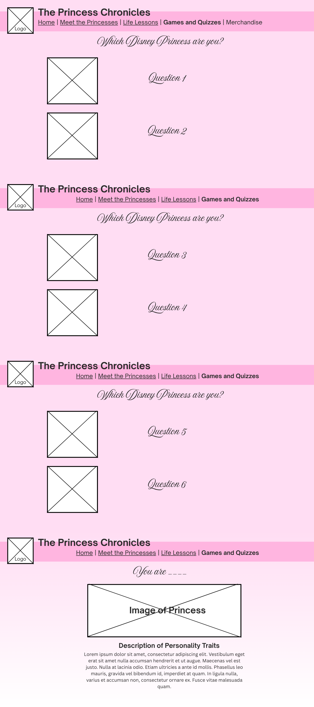
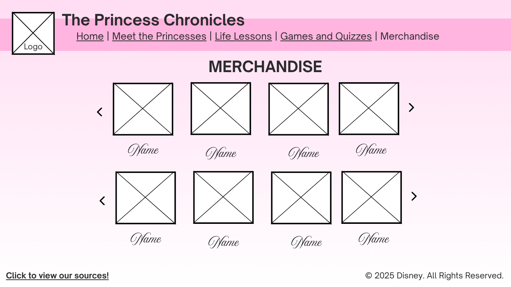

# WDProjMgGabrielNidea Project Proposal

## Website Title
**The Princess Chronicles**

## Second Title
*Where Magic, Courage, and Dreams Come Alive*

## Logo

## Description
**The Princess Chronicles** is an immersive website that brings Disney princesses to life for fans of all ages. Beyond simple biographies, users can explore **beautifully designed pages with animated elements, sliding galleries, and dynamic panels**, ultimately creating a modern storybook experience online.  

Each princess’s individuality, the challenges they faced, and the lessons they learned are highlighted to make the site **both entertaining and inspiring**. This website features the stories behind the faces of Disney and brings to life the real magic behind every princess.

## Webpage Breakdown

### Homepage
- Animated landing banner showing all princesses  
- This will feature a header, with a simple menu on the top section wherein the user can go to the other webpages (Home, Princesses, Adventures, Media, Fan Realm).
- **JavaScript-powered carousel** of all princesses  
- Navigation bar on top with title of website
- Smooth scrolling for easy navigation (use of scroll bar)

### Princess Profiles
- Detailed sections for **Tiana, Ariel, Rapunzel, Belle, Aurora**  
-  Includes sections of:
  - **Biography**  
  - **Story Highlights**  
  - **Quotes**  
  - **Fun Facts**  
- Hover animations for images  
- Embedded clips of songs or scenes from their movies

### Adventures & Life Lessons
- Animated story panels showing each princess’s journey  
- Hover pop-ups with short **“Life Lessons”** and their relevance in today’s world  

### Media & Merchandise
- Card-based layout for **movie clips, trailers, and products**  (referenced from Disney's official website)
- Hover animations for visual appeal  
- Embedded YouTube trailers and merchandise previews  

### Games and Quizzes
- This features a game powered by javascript entitled "Which Disney Princess are you". This quiz will ask users questions based on their traits and likes. After they are done answering, the site will show which Disney Princess best suits their personality.

### Disney Merchandise
- This features Official Disney Merch like shirts, accesories, hats and many more! 

### Sources & References
- Organized citations and links to the **Official Disney Website**  
- Hyperlinked text with hover highlights  
- Fun icons beside each type of source (**books, videos, articles**)  

## Other Notes
- Each subpage has a **side menu** with a circular figure (representing a crown/tiara) that expands on hover to show the other pages    
- **Sources page** will not be in the side menu but accessible via a **footer hyperlink**  
- Navigation will remain consistent across all pages  

## JavaScript Application
- **Main Use 1:** Home Page carousel 
  - Users can click **arrow buttons** or swipe (on mobile) to switch between princesses  
  - Carousel auto-slides every few seconds  
  - Clicking a princess image dynamically redirects to her profile without reloading the page  
- **Main Use 2:**: Mini quiz: Which Disney Princess are you?
  - A **JavaScript-powered personality game** designed to engage users  
  - The quiz presents a series of questions about the user’s **traits, preferences, and interests**  
  - Each answer is associated with a specific Disney Princess  
  - Upon completion, the quiz dynamically calculates the results and displays **which Disney Princess best matches the user’s personality**  
  - Provides a fun, interactive way for users to explore the characters and encourages **replayability**  
- **Additional JS Features:**  
  - Poll voting logic (simple vote counter)  
  - Hover pop-ups for **Life Lessons**  

## Wireframes:

