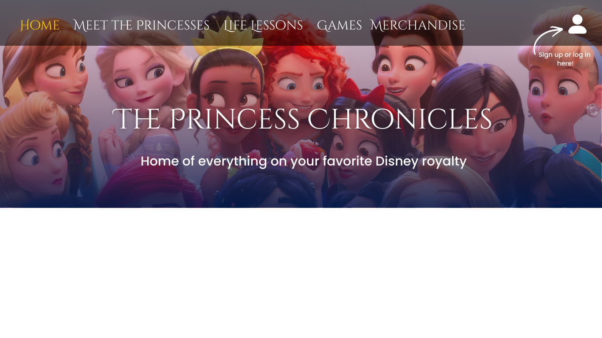
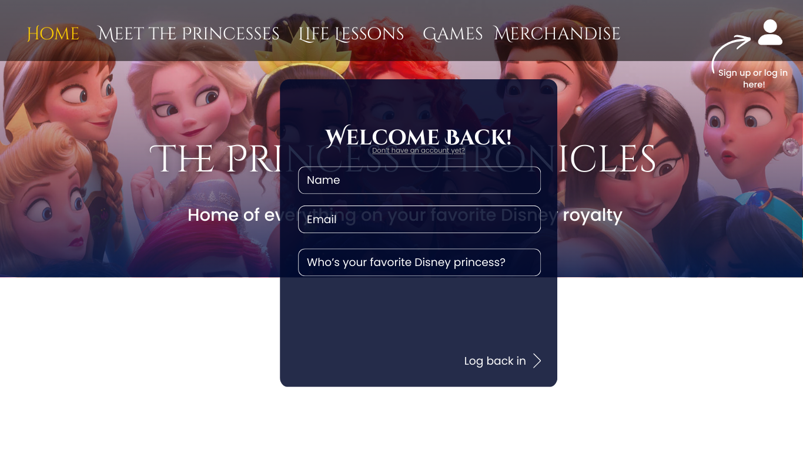
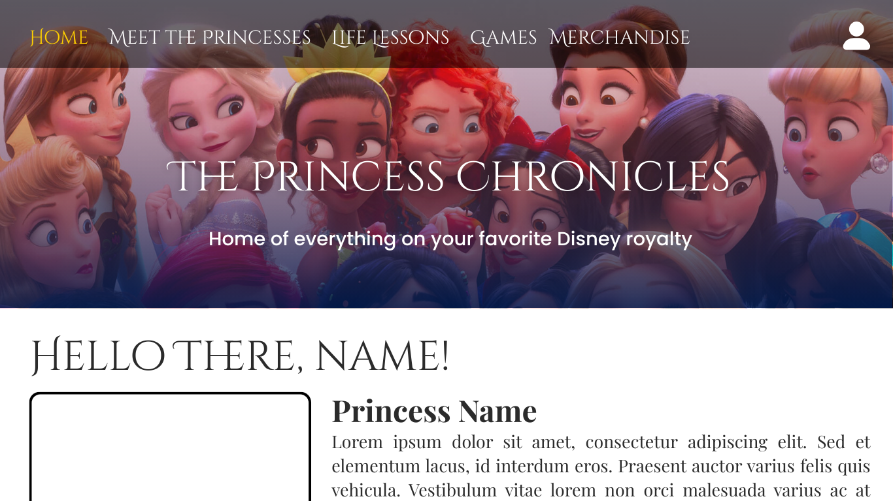
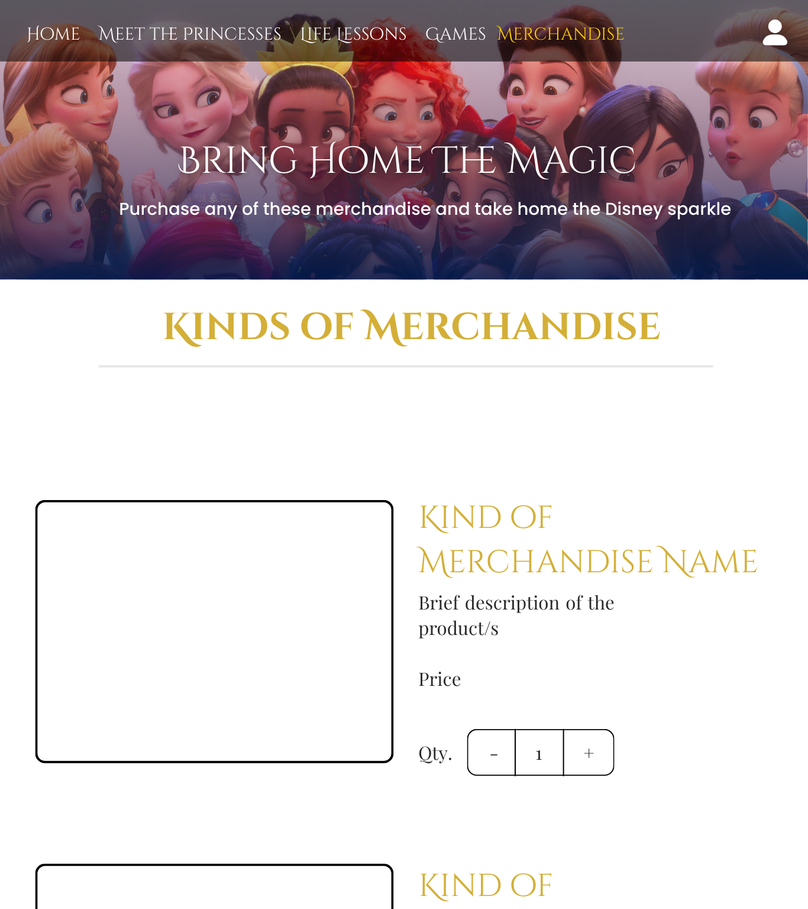

# HTML Form Design and Narrative – The Princess Chronicles

## Purpose of the HTML Form
The website will include **interactive HTML forms** to enhance user engagement and provide personalized experiences. These forms serve two main purposes:

### 1. User Sign-Up & Profile Creation
- Collects basic user information: **full name, email address, birthday, and favorite Disney princess**.  
- This information will be **saved on the user’s computer using localStorage**, allowing the website to remember the user’s preferences for personalized content and access to special features such as:
  - Personalized quiz recommendations.  
  - Access to exclusive content.  
  
### 2. Order / Merchandise Form
- Collects information on users ordering Disney merchandise: product choice, quantity, and delivery information.  
- Data is **saved temporarily in localStorage** to calculate total costs and allow the user to review their order before checkout.  

---

## Key Form Features
- Text input fields for **names, email, and addresses**  
- Dropdown menus for **favorite princess or merchandise options**  
- Date input for **birthday**  
- Number input for **quantity of items ordered**  
- Submit buttons that trigger **JavaScript functions to store form data in localStorage**  
- Validation to ensure all required fields are filled before submission  

---

## Webpage 1 – User Sign-Up Form
**Title:** Create Your Princess Profile  
**Purpose:** Collect and save user data locally  

**Layout & Form Elements:**  
- **Header:** “Welcome to The Princess Chronicles – Create Your Profile”  
- **Form Fields:**  
  - Full Name (text input)  
  - Email Address (email input)  
  - Favorite Princess (dropdown: Tiana, Ariel, Rapunzel, Belle, Aurora)  
  - Birthday (date input)  
- **Submit Button:** “Save Profile”  

**Behavior:**  
- JavaScript stores the data in **localStorage** when submitted  
- Redirects the user to the **Personalized Dashboard Page**  

---

## Webpage 2 – Personalized Dashboard
**Title:** Your Princess Journey  
**Purpose:** Retrieve and display user information for a personalized experience  

**Layout & Features:**  
- Greeting: “Welcome, [User Name]!”  
- Favorite Princess Display: Shows image and short description based on user selection. Includes a short description showing how the princess reflects the user’s personality.  
- Quiz Recommendations: Suggests the **“Which Disney Princess Are You?”** quiz  

**Behavior:**  
- JavaScript retrieves profile data from **localStorage** and populates page elements  
- Users can update their profile, which updates localStorage  

---

## Webpage 3 – Merchandise & Order Review
**Title:** Checkout Your Magical Merchandise  
**Purpose:** Use saved order data to calculate total payment and review user orders  

**Layout & Features:**  
- **Order Summary Table:** Lists product name, quantity, price, and total cost (using **objects and arrays**)  
- **Calculate Total Button:** JavaScript computes total from localStorage data  
- **Submit Order Button:** Finalizes order and clears localStorage when the session ends  

---
 ## Wireframes

 
 
 
 
 

## FINAL MODIFICATION PROPOSAL

# **HTML Form Design and Narrative – The Princess Chronicles**

## **I. Purpose of the Update**

The purpose of this final modification is to enhance the existing website by implementing a complete **CRUD (Create, Read, Update, Delete)** system using localStorage. The current version of the website allows users to input and save their personal data such as name, age, date, and favorite Disney princess. However, the system is limited because users are unable to manage their data after submission.

This update introduces a redesigned system that enables users to fully interact with their stored data. Users will be able to *create multiple entries*, *view saved information*, *update their details*, and *delete entries* when needed. The goal of this improvement is to make the website more dynamic, interactive, and reflective of real-world applications where users have control over their own data.

## **II. Design and Narrative of Data Management**

The updated system will store user data in the browser's localStorage as an array of objects. Each object represents a single user profile containing fields such as name, age, date, favorite princess, rating, and personal reflection. Instead of storing only one user entry, the system will allow multiple entries to be saved. This enables better demonstration of data management and allows users to interact with multiple records. The website will include a new interface where all saved data can be viewed in a structured and organized manner. Each entry will be displayed as a card containing the user's information. Along with the displayed data, each card will include options to edit or delete the entry. The update process will allow users to modify their existing data. When a user selects the edit option, the original data will be loaded into a form where changes can be made. After submission, the updated information will replace the previous data in localStorage.

The delete process will allow users to remove specific entries. When a user selects the delete option, the chosen entry will be removed from localStorage and the displayed list will automatically update to reflect the change. This design ensures that users have full control over their data and can manage it efficiently within the website.

## **III. Implementation of CRUD Operations**

### **1. Create**

The create operation is implemented through the login page form. Users will input their personal information, including name, age, date, favorite princess, and additional fields such as rating and personal notes. Upon submission, this data will be stored in localStorage as part of an array of user objects. Each entry will be assigned a unique identifier to distinguish it from other records.

This modification improves the original system by allowing multiple entries to be stored instead of a single record.

### **2. Read**

The read operation will be implemented through a new page or section that displays all saved user entries. This page will retrieve the stored data from localStorage and dynamically generate visual cards for each entry.

Each card will clearly present the stored information, including the user's name, selected princess, rating, and notes (description on why that is there favorite princess). This allows users to easily view and review all previously saved data in an organized format.

### **3. Update**

The update operation allows users to modify their existing data. Each displayed entry will include an edit option. When selected, the system will retrieve the corresponding data and populate it into an editable form. Additionally, users will be able to change any of the stored fields, such as their favorite princess, rating, or notes. After submitting the updated form, the system will locate the original entry using its unique identifier and replace it with the updated data in localStorage.

This ensures that the stored information remains accurate and up to date each time the user logs in.

### **4. Delete**

The delete operation allows users to remove entries from the system. Each entry displayed on the profile page will include a delete option. hen selected, the system will identify the specific entry and remove it from the array stored in localStorage. The interface will then refresh to reflect the removal of the entry. This functionality provides users with full control over their stored data and ensures that unwanted or outdated entries can be easily removed.

## **IV. Updated Wireframes**

### **Login Page (Updated)**

The login page will be enhanced to include additional input fields that support the CRUD system. In addition to the existing fields, new inputs such as a rating system and a notes section will be added. These fields allow users to provide more detailed information, which can later be viewed and edited.

The layout will remain similar to the current design, with improvements focused on functionality rather than major structural changes.

### **Profile Page (New)**

A new page will be introduced to display all saved user entries. This page will present data in a card-based layout, where each card represents one user profile. 

Each card will include:

- User information (name, age, date)
- Selected favorite princess
- Rating and personal notes
- Buttons for editing and deleting the entry
Essentially, it is a compilation of all the entries that inputted in the log in page, for every time they logged into the website.

This page serves as the central interface for managing stored data and demonstrates the read, update, and delete operations of the CRUD system.

### **Edit Functionality**

When the user selects the edit option, the system will redirect to or reuse the form interface with pre-filled data. The submit button will function as an update action instead of creating a new entry. This allows seamless modification of existing data without requiring a separate interface. 

## **V. Integration with Existing Website**

The CRUD system will be integrated into the existing website structure. The login page will handle the creation and updating of data, while the new profile page will handle the display and deletion of entries. The navigation bar will be updated to include access to the profile page, allowing users to easily switch between creating new entries and managing existing ones. This integration ensures that the new functionality complements the existing design while improving overall usability.

## **VI. Summary**

The final modification introduces a complete CRUD system that allows users to *create, read, update, and delete* data within the website. This significantly improves the functionality of the system by enabling full data management.

The implementation of CRUD operations transforms the website into a more interactive and practical application, where users are not limited to simply submitting data but can actively manage it. This update demonstrates the use of localStorage as a client-side data management tool and highlights the importance of CRUD operations in web development. By incorporating these features, the website becomes more dynamic and user-focused, providing a more meaningful and engaging experience. The final system reflects real-world application behavior and fulfills the requirement of implementing a complete CRUD process within the project.